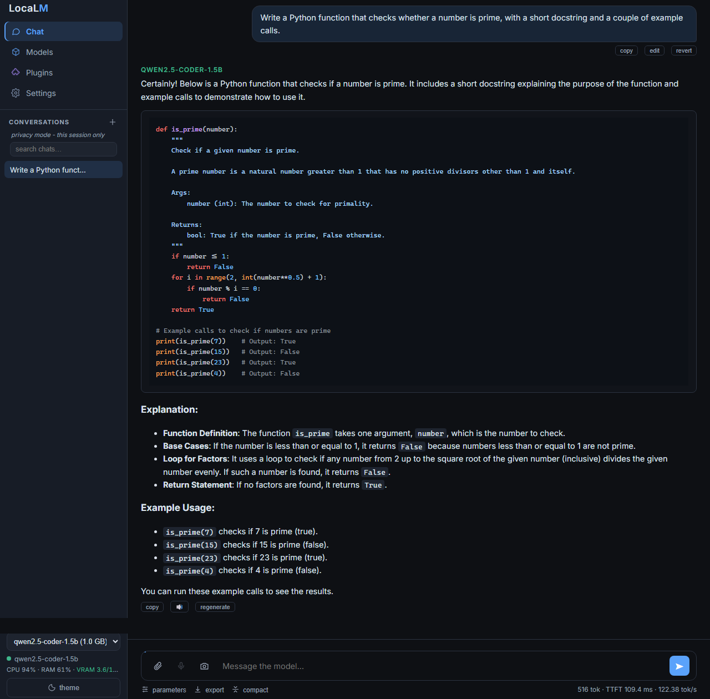
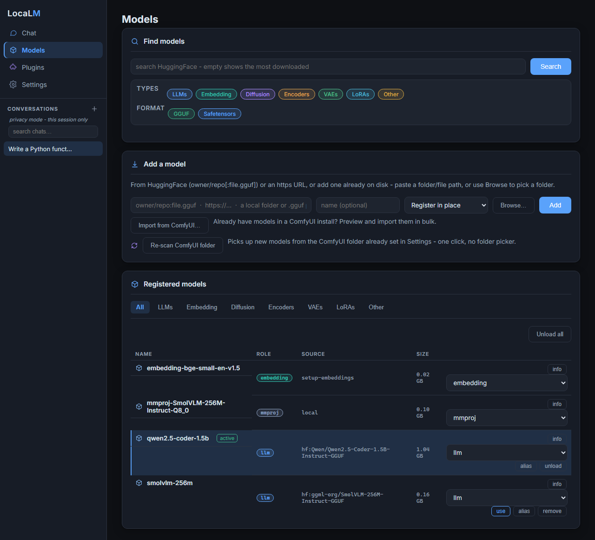

<p align="center">
  
</p>

**Offline local LLM inference and extension platform - GGUF and HuggingFace models, OpenAI-compatible server, agentic coding, media generation, RAG, and more through a plugin engine.**


LocaLM runs GGUF models through a pure-Python ctypes binding to `llama.dll` (no `llama-cpp-python`), runs HuggingFace Transformers models, and exposes both through an OpenAI-compatible HTTP server. At its core it is a **model loader plus a plugin engine**: the only always-present feature is **chat**, shipped as a protected, preinstalled plugin. Everything else - the coder agent, image/music/video generation, Knowledge (RAG), web access, durable memory, voice, text-to-speech, scheduled jobs, and MCP - is a plugin you install when you want it. One CLI, no cloud required.

Everything that does not strictly need the internet works fully offline. Online providers (OpenAI, Anthropic) exist only as explicit opt-ins for the coder agent and are never a default. When a task does need the web (current docs, the weather), the coder and chat reach it through a single policy choke point: `off` / `ask` / `allow` modes, domain allow/deny lists, and a private-address SSRF guard ([guide](docs/network.md)).

<p align="center">
  <br>
  <sub>Chat - streaming replies, markdown, syntax-highlighted code</sub>
</p>

<p align="center">
  <br>
  <sub>Models - GGUF and HuggingFace side by side, typed and color-coded</sub>
</p>

## Quick start

```bash
localm pull owner/repo:model-Q4_K_M.gguf   # Download a GGUF from HuggingFace
localm gui                                  # Chat + coder + plugins in your browser
localm run mymodel --prompt "Explain RDNA2" # Offline terminal chat or single prompt
localm serve mymodel                        # OpenAI-compatible API server
```

## Contents

- [Features](#features)
- [Requirements](#requirements)
- [Install](#install)
- [First success](#first-success)
- [CLI reference](#cli-reference)
- [Plugins](#plugins)
- [GPU setup](#gpu-setup)
- [Architecture](#architecture)
- [Documentation](#documentation)
- [Getting help](#getting-help)
- [License](#license)

---

## Features

- **Local model inference.** GGUF files load through a small ctypes binding to `llama.dll`, so there is no `llama-cpp-python` to build. HuggingFace Transformers models work too, including native AWQ-quantized models with GPU inference and no extra dependency beyond the `[gpu]` extra. Some GGUF models get a free speed-up from built-in speculative decoding (Multi-Token Prediction) when the model and runtime support it - no extra setup, it just engages when it can. The installer detects your GPU and picks the best backend it can run out of the box - **CUDA for NVIDIA, ROCm/HIP for AMD when a system toolkit is present, Vulkan as the universal fallback** (any AMD/NVIDIA/Intel GPU, no vendor toolkit needed), **CPU** when there is no GPU - and localm auto-detects the GPU at load.

- **Pick how you talk to it.** A browser GUI (optionally its own OS app window instead of a tab, see [native app](docs/native-app.md)), a plain terminal chat, and an OpenAI-compatible server for when you want other apps to connect.

- **A coding agent that does the work (coder plugin).** `localm coder` works through a task with tools for files, the shell, search, and tests; you can redirect it mid-run or review what it touched with session diffs. It speaks MCP both ways, so localm can expose your models to clients like Claude Desktop, and the coder can pull in external MCP tool servers.

- **Media generation (image/music/video plugins).** localm drives a local media-generation server (**ComfyUI is the supported backend today**, with a seam for others later). Point it at your own ComfyUI, or let localm run its **own** managed ComfyUI (opt-in) so it can pin a known-good version and carry fixes without touching your install ([guide](docs/managed-comfyui.md)). Either way localm orchestrates generation and VRAM handover from the LLM, and surfaces it through `localm image` / `music` / `video`, the Images/Music/Video GUI pages, and chat commands.

- **Bring your own data (rag, voice, and tts plugins).** Attach files or index whole folders and chat against them with citations (Knowledge), dictate with local Whisper speech-to-text, or have replies read back to you with in-browser Kokoro text-to-speech.

- **Remembers you across chats (memory plugin).** Opt in and localm keeps durable facts about you - your preferences, projects, and ongoing context - and recalls them in later chats, so you do not repeat yourself every session ([guide](docs/memory.md)).

- **Schedule it (jobs plugin).** Run a chat or coder prompt on an interval or a cron schedule from an in-app scheduler, the terminal, or a REST API ([guide](docs/jobs.md)).

- **Model management that stays out of the way.** Pull from HuggingFace with aliases and SHA256 dedup, browse quants with a note on whether they fit your VRAM, and let localm register whatever you drop into the models folder. Types are detected deterministically from the file itself; anything it cannot classify is left as `unknown` (still runnable by name, never auto-loaded for chat) and you can correct it with `localm set-type`.

- **Offline first.** Nothing leaves your machine unless you allow it. The optional online parts (cloud providers for the coder, web access for fetching pages) are opt-in, and every outbound request - including the periodic update check - runs through one network policy you set ([details](docs/privacy.md)).

---

## Requirements

- **Python 3.12** (the project pins `requires-python = >=3.12,<3.13`). The installers build a 3.12 venv, and the `[gpu]` ROCm torch wheels are cp312-only.

- **For GGUF GPU inference:** a compiled `llama.dll` + GPU runtime DLLs. `localm setup-llama` provisions these for you (see [GPU setup](#gpu-setup)). The installer detects your hardware and chooses the backend automatically.

- **NVIDIA CUDA (peak performance):** on **both Windows and Linux** the installer recommends **CUDA** for NVIDIA - it fetches a self-contained CUDA runtime (no Toolkit needed on either OS), and an old driver simply falls back to Vulkan. Prefer the universal driver-only build? Choose **Vulkan** in the setup menu (or `localm setup-llama --backend vulkan`). Details in [GPU setup](#gpu-setup).

Run `localm doctor` after installing to check Python, the native library, GPU driver, VRAM, and optional packages in one shot.

If localm ever fails to start (or setup itself fails), you can still file a bug report: double-click `report-issue.bat` (Windows) or run `bash report-issue.sh` (Linux/macOS) from the clone. It shows you exactly what will be sent, files an account-less GitHub issue (no GitHub login needed), and works even with a broken or missing install.

---

## Install

> **Stable release:** to install a specific tagged version instead of the latest
> `master`, clone that tag, for example:
> `git clone --depth 1 --branch v0.1.0 https://github.com/Matlan1/localm.git`
> then follow the setup below inside the clone.

### Prefer a window? Use the graphical installer

Double-click **`setup-gui.bat`** (Windows) or run **`./setup-gui.sh`** (Linux/macOS) and the whole install happens in a window: pick your inference runtime (your hardware's recommendation is preselected), where data should live, whether the GUI opens as an app window or a browser tab, and whether you want a desktop shortcut and a global `localm` command. Then it installs, with a progress bar and a live log, and offers to start LocaLM when it is done.

It performs exactly the same install as the console setup below, asking the same questions in the same order. Everything after this section describes the console path; if you used the window, you are already finished.

### Recommended (Windows): self-contained setup

Clone anywhere and double-click `setup.bat`. It installs `uv` (the Python package manager it builds on) for you if you do not already have it, creates a private `.venv` inside the clone (always Python 3.12), installs localm into it, detects your GPU and provisions the matching llama.cpp backend (see [GPU setup](#gpu-setup)), and asks where data should live:

- **inside the clone** (`.\home`) - fully portable and self-contained; multiple clones on one machine are completely independent (this is the default), or
- **a custom path** (recorded in `localm-home.cfg`) - e.g. a shared models drive.

There is no silent per-user fallback: if nothing is configured, localm keeps its data in a contained `.\home` inside the install and says so, never a shared `~/.localm` outside it. It then builds a native `LocaLM.exe` launcher (so the running server shows as `LocaLM.exe` in Task Manager, not `python.exe`, and carries the LocaLM icon - see [native app](docs/native-app.md)), offers an optional desktop shortcut and global `localm` command, and walks you through which plugins to enable (`localm plugin setup`). Along the way it also asks whether `localm gui` should open as its own app window or a browser tab (default: browser tab; see [native app](docs/native-app.md)). Nothing is installed globally, and your PATH is left untouched unless you opt into the global `localm` command. The `LOCALM_HOME` environment variable overrides the data location at any time.

### Recommended (Linux/macOS): self-contained setup

The same self-contained install, one command:

```bash
curl -fsSL https://raw.githubusercontent.com/Matlan1/localm/master/install.sh | bash
```

This clones localm to `~/localm`, creates a private `.venv`, detects your GPU, and provisions the matching backend non-interactively. For the interactive version (`bash setup.sh` from a clone, same prompts as `setup.bat` above), GPU-backend details, and macOS's experimental status, see [docs/linux-setup.md](docs/linux-setup.md).

### Manual (any OS)

This path uses `uv` directly, so it assumes `uv` is installed (the `setup.bat` /
`setup.sh` installers add it for you; standalone: `powershell -c "irm
https://astral.sh/uv/install.ps1 | iex"` on Windows, or `curl -LsSf
https://astral.sh/uv/install.sh | sh` on Linux/macOS).

```bash
# Portable (default, self-contained): keeps uv's downloaded Python runtime AND
# its wheel cache inside this clone too, so nothing is read from or written to
# your user profile - matches setup.bat/setup.sh's own default "Portable"
# choice. The UV_* vars only apply to this one command, never persisted.
UV_PYTHON_INSTALL_DIR="$PWD/.python" UV_CACHE_DIR="$PWD/.cache" \
  uv venv --python 3.12 --python-preference only-managed .venv
uv pip install -p .venv -e ".[coder,voice,monitor]"       # base: NVIDIA / Intel / CPU (GGUF chat needs no torch)
uv pip install -p .venv -e ".[coder,voice,monitor,gpu,audio]"   # AMD RDNA2 ROCm ONLY - do NOT use on NVIDIA/Intel
localm setup-llama                                 # provision the native llama.cpp backend (Vulkan/CUDA/CPU)
```

(`voice` adds the GUI mic's Whisper speech-to-text; drop it if you do not want it.)

To instead reuse a Python + package cache already on your system (faster, one
download shared across every uv project on the machine, but no longer
self-contained - the same tradeoff `setup.bat`/`setup.sh`'s "Shared" choice
describes), just drop the `UV_PYTHON_INSTALL_DIR`/`UV_CACHE_DIR`/
`--python-preference` and run the plain `uv venv --python 3.12 .venv`.

The base line above works on NVIDIA, Intel, and CPU; only AMD RDNA2 users add `[gpu]` (the ROCm torch stack). `localm setup-llama` is required after a manual install to fetch the native backend (`setup.bat` does this for you). NVIDIA users who also want HuggingFace/torch models install CUDA torch separately - the index depends on GPU generation (Blackwell and newer need a different one than older cards), so ask localm's own detector rather than guessing: `uv pip install -p .venv $(.venv/bin/python -m localm.hwdetect torch-args cuda)` (see [docs/gpu-setup.md](docs/gpu-setup.md#huggingface-transformers-pytorch) for the full table and Windows form).

A pip extra and a plugin install are two separate steps. The extra installs a plugin's heavy Python dependencies into the venv; `localm plugin install <name>` activates the plugin itself. The defined extras are:

| Extra | What it adds |
|---|---|
| `coder` | The AI coding agent (opt-in marker; deps are already core) |
| `desktop` | Native OS app window for `localm gui` instead of a browser tab (`pywebview`; see [native app](docs/native-app.md)) |
| `gpu` | AMD RDNA2 ROCm 7.13 stack: torch, transformers, rocm-sdk (Windows, Python 3.12) |
| `audio` | Audio multimodal input (`soundfile`) |
| `rag` | PDF parsing for Knowledge (`pypdf`); other formats are stdlib |
| `voice` | Whisper speech-to-text for the GUI mic (`faster-whisper`, CPU, no torch) |
| `monitor` | Live hardware monitor in the GUI status bar (`psutil`) |
| `grammar` | Grammar-constrained decoding for HuggingFace models (`xgrammar`, layers on `[gpu]`) |
| `cpu` | Explicit CPU-only marker (empty; core already runs GGUF on CPU) |
| `dev` | Contributor / CI tooling: `ruff`, `pytest`, `pytest-cov`, `pytest-xdist`, plus `pypdf`/`psutil` so the tests that need them do not skip |

Not every plugin needs an extra: the image/music/video plugins talk to an external media-generation server you run (ComfyUI today), jobs and web have no extra, and tts runs in the browser.

> **Avoid `uv tool install` for this project.** Tool installs are *global per package name*, so a second clone would silently replace the first one's `localm.exe`.

### No models yet?

On a fresh install the launcher's **Import** row gets you a first model three ways: *from file...* / *from folder...* register a GGUF or a HuggingFace directory already on disk, and *from URL...* opens the Web GUI on its Models page and downloads the model there with a live progress bar. You can also launch the Web GUI with no models (`localm gui --no-model`); it opens straight to the Models page.

---

## First success

### 1. Download a model

```bash
# Specific GGUF from any HF repo (split files are handled automatically)
localm pull owner/repo:model-Q4_K_M.gguf

# Full HuggingFace model directory (transformers format)
localm pull owner/model-name

# Direct URL, with optional integrity check
localm pull https://example.com/m.gguf --sha256 <hash>
```

Duplicate downloads are detected by path and SHA256. When you add or pull something already registered, localm offers alias / copy / move / skip instead of silently duplicating gigabytes.

### 2. Open the GUI

```bash
localm gui                # picks the first registered model, opens your browser
localm gui mymodel        # or name one
localm gui --no-model     # open model-less, straight to the Models page
```

Chat, the coder agent, model management, and any enabled plugin tabs in one page. The model preloads in the background so the first reply is fast. See [docs/gui.md](docs/gui.md) for details.

### 3. Or use the terminal

```bash
localm run mymodel --prompt "What is 42?"     # single prompt
echo "Translate 'hello' to Japanese." | localm run mymodel  # pipe input
localm run mymodel                             # interactive chat
```

### 4. Or start a server

```bash
localm serve mymodel
```

localm owns the port range 8642-8741: the default is 8642 and the server bumps to the next free port automatically when it is taken.

```bash
curl http://localhost:8642/health
curl -X POST http://localhost:8642/v1/chat/completions \
  -H "Content-Type: application/json" \
  -d '{"model": "mymodel", "messages": [{"role": "user", "content": "Hello!"}], "stream": true}'
```

Use it with any OpenAI client:

```python
from openai import OpenAI
client = OpenAI(base_url="http://localhost:8642/v1", api_key="localm")
resp = client.chat.completions.create(
    model="mymodel",
    messages=[{"role": "user", "content": "Hello!"}],
)
print(resp.choices[0].message.content)
```

Any OpenAI-compatible client works the same way, including AI browsers with a local-model option (BrowserOS and similar), LM Studio, and Ollama - point them at the same base URL.

The usage block adds performance numbers - which fields appear depends on streaming and the endpoint; see [docs/server-api.md](docs/server-api.md) for the full breakdown and API surface.

---

## CLI reference

The full CLI reference lives in [docs/cli.md](docs/cli.md). Here are the core commands:

```bash
localm run MODEL                  # interactive chat or single prompt
localm gui [MODEL]                # browser GUI
localm serve MODEL                # OpenAI-compatible server
localm coder [TASK]               # AI coding agent
localm benchmark MODEL            # TTFT and tok/s measurements
localm doctor                      # check installation
localm info                        # paths and config
localm update                      # apply a signed update (you always initiate it)
```

Model management:

```bash
localm pull SPEC                  # download from HuggingFace or URL
localm search QUERY               # search HuggingFace for GGUF models
localm add PATH                   # register a local model (--store copy|move to import it into <data dir>/models)
localm alias MODEL NEWNAME        # add a second name
localm rename MODEL NEWNAME       # rename it outright (unlike alias, the old name stops working)
localm set-type MODEL TYPE        # fix a model's detected type (llm, vae, lora, unknown, ...)
localm list [--type TYPE]        # registered models, optionally filtered by type
localm rm MODEL                   # remove a model
```

Plugins:

```bash
localm plugin status              # what is installed
localm plugin install NAME        # enable a plugin
localm plugin disable NAME        # turn off a plugin
```

Full reference: [docs/cli.md](docs/cli.md).

---

## Plugins

localm core is a model loader plus a plugin engine. Chat is preinstalled and active out of the box; every other feature is a plugin you install when you want it.

**Plugin states.** Bundled plugins live read-only in `localm/plugins/builtin/` (the "store"). *Installing* copies one into `<data dir>/plugins/` (installed = on disk); *enabling* adds it to `config["plugins_enabled"]`; a plugin is *active* only when it is both installed and enabled. Chat is protected (cannot be disabled or uninstalled) and `default_enabled`, so it is active on first run; nothing else is.

**First-party store plugins** are managed by name:

```bash
localm plugin status            # what is installed and which installs are active
localm plugin install NAME      # copy NAME from the store and enable it
localm plugin enable NAME       # enable an already-installed plugin
localm plugin disable NAME      # disable but keep it installed
localm plugin uninstall NAME    # remove it (add --delete-data to drop its data)
localm plugin setup             # pick a starter set interactively
```

The store names are `coder`, `image`, `music`, `video`, `rag`, `web`, `memory`, `voice`, `tts`, `jobs`, and `mcp` (plus the protected `chat`). For plugins with heavy Python dependencies, also install the matching pip extra (for example `pip install "localm[rag]"` alongside `localm plugin install rag`); see [Install](#install). A running GUI server picks up new HTTP routes and tabs at runtime, while stdio plugins like mcp take effect on the next `localm mcp`.

**Third-party plugins** are folders containing a `plugin.toml` manifest and Python files. Install a third-party plugin from a local path with `localm plugin install <path>` (the same command takes a store name or a directory); installation is a local directory copy, fully offline. See [docs/plugins.md](docs/plugins.md) for the full authoring contract.

---

## GPU setup

The native llama.cpp binaries live **inside this install**, packaged as the `localm-llama-runtime` wheel in the venv, so the project never depends on a folder elsewhere on disk. `localm setup-llama` provisions the backend matching your hardware (full list in [docs/gpu-setup.md](docs/gpu-setup.md)):

```bash
localm setup-llama                       # auto-detect the GPU, fetch the right backend
localm setup-llama --backend vulkan      # any GPU (AMD/NVIDIA/Intel), no vendor toolkit
localm setup-llama --backend cuda        # NVIDIA  /  --backend amd-rocm (AMD)  /  --backend cpu
localm setup-llama --from <build-dir>    # or copy your own llama.cpp build
```

Vulkan runs on any GPU with just the vendor's normal driver; CUDA/ROCm give peak performance when their runtime is present; CPU always works. The AMD ROCm build is self-contained (it bundles its ROCm runtime via the `[gpu]` extra's `rocm-sdk` wheels). macOS/Metal is experimental. See [docs/phone.md](docs/phone.md) to reach the GUI from a phone.

**NVIDIA users:** on **both Windows and Linux** the installer recommends **CUDA** (peak performance) - press Enter to accept it: it fetches a self-contained CUDA runtime (no Toolkit needed - a third-party build plus the CUDA runtime libraries on Linux, the official build plus a `cudart` bundle on Windows), verifies the build loads, and falls back to Vulkan with a clear message if your driver is too old for the CUDA line your GPU needs (12.4+ for most GPUs; Blackwell - RTX 50-series and datacenter B100/B200 - is detected automatically and needs a newer driver, CUDA 13.3+, for its own 13.x build). Prefer the universal driver-only build with no vendor-runtime download? Choose **Vulkan** in the setup menu (or run `localm setup-llama --backend vulkan`).

localm resolves the binary directory in order: `LLAMA_CPP_LIB` env > `binary_dir` config > the bundled runtime wheel. No absolute path is ever assumed as a default; an unprovisioned install resolves to nothing and points you at `localm setup-llama`. Before loading a model, localm checks free VRAM against the model size and warns when it will not fit, instead of crashing mid-load.

---

## Architecture

localm is a **model loader plus a plugin engine**. The CLI knows nothing about inference and inference knows nothing about the CLI; they meet at a single `Engine`. Chat is the protected plugin #0; every other feature is a plugin layered on top.

```
runtime/            # localm-llama-runtime wheel: native llama.cpp binaries (in the venv)
localm/
├── cli/            # Click command package
├── inference/      # Engine (GGUF vs HF), FastAPI server, routes, backends/llamacpp (ctypes binding)
├── model_manager/  # registry, pull, dedup, aliases
├── image_gen/ music_gen/ video_gen/ media/   # ComfyUI transports for the media plugins
└── plugins/        # the plugin engine + every feature plugin (builtin/ = the read-only store)
```

See [docs/architecture.md](docs/architecture.md) for the full module map and design notes.

### The ctypes llama.cpp binding

`localm.inference.backends.llamacpp` is a zero-dependency Python wrapper around the native `llama.dll`, replacing `llama-cpp-python` entirely:

- **No C compiler** needed at install time
- **No Python wheel** tied to a specific Python/CUDA version
- Any prebuilt `llama.dll` works: Ollama's DLL, a custom build, any binary

See [docs/llamacpp-binding.md](docs/llamacpp-binding.md) for the binding internals: struct layouts, ABI checks, and the full sampler chain.

## Documentation

| Doc | Contents |
|---|---|
| [docs/cli.md](docs/cli.md) | Full CLI reference (model management, media, RAG, jobs, config, shell completion) |
| [docs/plugins.md](docs/plugins.md) | Authoring a plugin: manifest, tool exports, surfaces, chat-pipeline hooks, privacy rules |
| [docs/plugin-interop.md](docs/plugin-interop.md) | Foreign-ecosystem interop: importing plugins from other tools over the MCP spine |
| [docs/skills.md](docs/skills.md) | The Agent Skills (`SKILL.md`) importer for the coder agent |
| [docs/gui.md](docs/gui.md) | The web GUI: chat, coder sessions, studios, Jobs, approvals, security notes |
| [docs/jobs.md](docs/jobs.md) | Scheduled jobs: the scheduler, `localm job` CLI, `/api/jobs`, the Jobs tab |
| [docs/mcp.md](docs/mcp.md) | MCP in both directions: serving models, consuming tool servers |
| [docs/server-api.md](docs/server-api.md) | HTTP API: OpenAI endpoints, management routes, auth, CORS |
| [docs/architecture.md](docs/architecture.md) | Design notes |
| [docs/llamacpp-binding.md](docs/llamacpp-binding.md) | The ctypes binding internals |
| [docs/gpu-setup.md](docs/gpu-setup.md) | GPU/DLL setup |
| [docs/linux-setup.md](docs/linux-setup.md) | Running localm on Linux: venv, runtime, GPU notes |
| [docs/flux-setup.md](docs/flux-setup.md) | ComfyUI FLUX image pipeline (shared by music/video) |
| [docs/managed-comfyui.md](docs/managed-comfyui.md) | localm's own managed ComfyUI: `localm comfy setup`, coexistence, shared models |
| [docs/video.md](docs/video.md) | Wan 2.2 video generation: model setup, timing, workflow override |
| [docs/rag.md](docs/rag.md) | Knowledge: chat with your documents, collections, retrieval design |
| [docs/memory.md](docs/memory.md) | Durable memory: recall across chats, consolidation, privacy, `/api/memory` |
| [docs/network.md](docs/network.md) | Internet access for coder and chat: modes, domain rules, SSRF guard |
| [docs/tls.md](docs/tls.md) | API keys, TLS, and reverse proxies for LAN serving |
| [docs/privacy.md](docs/privacy.md) | Privacy modes and diagnostics: what localm saves, what it never does, the two independent dials that control it, and how the update check respects network policy |
| [docs/naming.md](docs/naming.md) | Reaching localm by name on your LAN: the localm.local mDNS address |
| [docs/phone.md](docs/phone.md) | Using localm from your phone: the installable PWA companion |
| [docs/native-app.md](docs/native-app.md) | The native `LocaLM.exe` launcher: how it works, `make-launcher`, the freeze trade-off |

### Test coverage

Every CI run measures coverage (`pytest --cov=localm`) and publishes it to that run's own summary page, which is not otherwise linked from anywhere. As a snapshot: the `full-ci` matrix run for [PR #1572](https://github.com/Matlan1/localm/pull/1572) (2026-08-27, windows-latest leg) measured **81%** combined statement+branch coverage, clearing the repository's 78% coverage floor (`pyproject.toml`, `[tool.coverage.report] fail_under`) with headroom to spare. A second, independent set of floors covers the trust-boundary modules least tolerant of a silent regression - `bindhost.py`, `scopes.py`, `pathsafe.py`, `netpolicy.py`, `auth.py`, `tls.py`, `config.py`, `portmux.py` - each with its own minimum (see `scripts/check_coverage_floors.py`, or run it with `--report` for the current numbers). This paragraph is a hand-updated snapshot, not a live badge, and can go stale between refreshes; the enforced numbers are always the CI gates themselves.

---

## Getting help

- **Bugs and crashes:** open an [Issue](https://github.com/Matlan1/localm/issues), or run `localm bug-report -m "..."` first to attach a safe hardware/backend snapshot.
- **Setup questions, GPU help (AMD/NVIDIA/Intel), "does this work with my card":** [Discussions](https://github.com/Matlan1/localm/discussions).
- **Security vulnerabilities:** see [SECURITY.md](SECURITY.md); do not open a public issue.

## License

Copyright (C) 2025-2026 Matlan1

localm is free software, licensed under the **GNU Affero General Public License, version 3 or later** (AGPL-3.0-or-later). See [LICENSE](LICENSE) for the full text.

In short: you may use, study, modify, and redistribute localm freely, including commercially. But if you redistribute it, or run a modified version as a network service, you must make the complete corresponding source available to your users under the same license. This keeps localm, and anything built on top of it, open.
