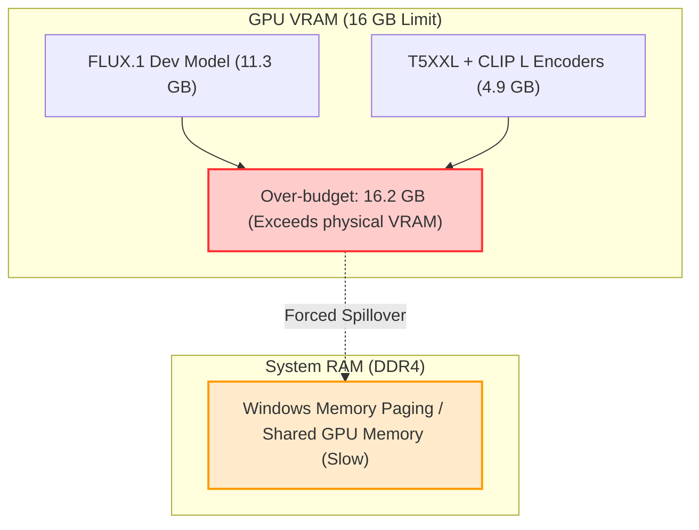

# Post-Mortem & Decision Log: Native ROCm FLUX Migration

This document records the architectural details, decision rationales, and performance optimizations established during the migration of ComfyUI and FLUX.1 to a native Windows ROCm environment on an AMD Radeon RX 6900 XT (16GB VRAM).

---

## 1. High-Level Architecture

The diagrams below compare the memory flow under the initial unoptimized configuration (which led to severe system RAM paging) versus the final optimized configuration.

### A. Unoptimized Configuration (High VRAM + Native PyTorch SDPA)


### B. Optimized Configuration (Normal VRAM + Split Cross-Attention)
```mermaid
graph TD
    subgraph VRAM ["GPU VRAM (16 GB Limit)"]
        active_model["Active Model (FLUX Sampler) ~8.1 GB"]
        attention_slice["Split-Cross Attention Slices (Low Memory overhead)"]
        free_space["Safe VRAM Headroom"]
    end
    
    subgraph SYS_RAM ["System RAM (DDR4)"]
        offloaded_weights["Offloaded CLIP/T5XXL Weights ~3.2 GB"]
    end
    
    SYS_RAM ===>|Async DMA Stream Transfer (Fast)| VRAM
    style active_model fill:#ccffcc,stroke:#33cc33,stroke-width:2px
    style offloaded_weights fill:#e1f5fe,stroke:#0288d1,stroke-width:2px
```

---

## 2. Decision Log (Why / Why Not)

### Decision 1: Migrating from ZLUDA to Native Windows ROCm
* **Context**: The system originally used ZLUDA (a translation layer translating CUDA calls to HIP).
* **Decision**: We migrated ComfyUI completely to native Windows ROCm (`torch==2.9.1+rocm7.13.0`).
* **Why**:
  * ZLUDA is archived and lacks support for newer PyTorch versions.
  * ZLUDA has fatal mapping bugs in `cuBLAS`/`rocBLAS` for consumer RDNA2 cards. Standard operations (like `cublasGemmStridedBatchedEx` during latent preview) threw `CUBLAS_STATUS_NOT_SUPPORTED` exceptions, forcing complex CPU-offload monkey-patches.
  * Native ROCm runs directly on AMD's compiler stack without translation overhead, ensuring faster raw execution speeds and native PyTorch compatibility.
* **Why Not Stay on ZLUDA?**: Maintaining the monkey-patch library stack across updates was unsustainable, and ZLUDA's lack of support for FP8 data types (`torch.float8_e4m3fn`) prevented running FLUX in its most VRAM-efficient format.

### Decision 2: Creating a Dedicated, Isolated Virtual Environment
* **Context**: Setting up the new Python ROCm environment.
* **Decision**: We created a fresh Python 3.12 virtual environment ([venv](file:///D:/stablematrix/Data/Packages/ComfyUI-Zluda/venv)) specifically for ComfyUI, rather than sharing the existing environment from the *Heresy* project.
* **Why**:
  * **Dependency Contamination**: ComfyUI and its custom nodes rely on specific, tight combinations of package versions (such as `onnxruntime`, `transformers`, `torchvision`, and `torchaudio`). Mixing them with the *Heresy* codebase would cause package conflicts.
  * **Stability Matrix Integration**: Stability Matrix launches packages using their relative `venv` directory. Swapping the new environment directly into ComfyUI's default folder allows the GUI's "Launch" button to work natively without manual launcher overrides.
* **Why Not Share?**: Sharing a single ROCm environment across multiple custom codebases risks breaking one project whenever the other updates a dependency.

### Decision 3: Downgrading `torchaudio` for Strict ABI Matching
* **Context**: ComfyUI failed to boot initially with a DLL loader error: `OSError: Could not load this library: _torchaudio.pyd`.
* **Decision**: We downgraded `torchaudio` from `2.11.0` (standard PyPI resolve) to `2.9.0+rocm7.13.0`, installing it from AMD's ROCm wheel index.
* **Why**:
  * The pre-compiled binary `_torchaudio.pyd` was compiled against a different C++ ABI than the installed `torch==2.9.1` package. When Python attempted to load the library, the entry points mismatched, crashing the import chain.
  * Standard `pip install` resolves packages without checking ROCm-specific C++ binary ABI compatibility. Fetching the exact matched version `2.9.0` from AMD's index restored the binary-level link.
* **Why Not Ignore it?**: `torchaudio` is imported during ComfyUI's custom node initialization phase (specifically for Audio VAE modules). A failure in this import crashes the entire server boot sequence.

### Decision 4: Disabling `HIGH_VRAM` in Favor of `NORMAL_VRAM` Offloading
* **Context**: Generational speeds were initially stuck at a slow `70+ s/it`.
* **Decision**: We set `--highvram` to `false` in [settings.json](file:///D:/stablematrix/Data/settings.json), forcing ComfyUI to utilize its normal/low VRAM offload pipeline.
* **Why**:
  * FLUX.1 Dev FP8 (11.3 GB) + Text Encoders (4.9 GB) exceeds the 16 GB physical VRAM limit of the RX 6900 XT.
  * In `HIGH_VRAM` mode, ComfyUI attempts to hold all weights in VRAM simultaneously. This forces Windows to spill the overflow into system RAM via Windows paging. Operating over system RAM is 10x–50x slower, bottlenecking the GPU.
  * Disabling `HIGH_VRAM` allows ComfyUI to offload the text encoders to system RAM while the sampler runs, keeping physical VRAM usage bounded.
* **Why Not Use High VRAM?**: While keeping everything in VRAM is faster on 24GB+ cards, it causes severe performance degradation on 16GB cards due to hardware swapping limitations.

### Decision 5: Bypassing Native PyTorch SDPA with `--use-split-cross-attention`
* **Context**: Even with offloading, the default attention backend ran at `70.79s/it` and threw warnings about missing memory-efficient attention.
* **Decision**: We forced `--use-split-cross-attention` instead of `--use-pytorch-cross-attention` or `--use-quad-cross-attention`.
* **Why**:
  * AMD's ROCm Windows PyTorch wheel was compiled without the CUTLASS memory-efficient attention kernels.
  * Because memory-efficient attention was unavailable, native PyTorch SDPA fell back to its standard Math backend. For FLUX (which uses a massive 512-token context length), the math backend scales memory quadratically ($O(N^2)$), instantly consuming all remaining VRAM and triggering memory paging.
  * `--use-split-cross-attention` manually slices attention calculations into tiny, serialized blocks. This keeps the execution memory footprint extremely small, keeping VRAM usage strictly below the 16GB boundary.
* **Why Not Use PyTorch Attention?**: While native PyTorch attention is faster in theory, on Windows ROCm the missing CUTLASS kernels render it unusable for models with large context windows like FLUX.

### Decision 6: Enabling GPU Text Encoding (`"device": "default"`)
* **Context**: The text encoding stage was running entirely on the CPU (taking 15–45 seconds) because the DualCLIPLoader node was explicitly configured with `"device": "cpu"`.
* **Decision**: We changed `"device": "cpu"` to `"device": "default"` in [flux_workflow.json (localm)](file:///D:/projects/localm/localm/plugins/coder/flux_workflow.json).
* **Why**: Running T5XXL inference on the CPU is incredibly slow. Since we configured ComfyUI with `--normalvram` offloading, ComfyUI can safely load the text encoder onto the GPU, execute the prompt tokenization step instantly (taking less than 1–2 seconds), and then offload it back to system RAM to make room for the main FLUX diffusion model. This reduces total generation startup overhead significantly.
* **Why Not Force CPU?**: Setting it to `"default"` lets ComfyUI automatically handle offloading based on the system's memory profile, rather than hardcoding CPU execution.

---

## 3. Performance & Verification Metrics

| Configuration | VRAM State | Attention Backend | Speed (s/it) | VRAM Allocation Status |
| :--- | :--- | :--- | :--- | :--- |
| **ZLUDA (Original)** | `HIGH_VRAM` | Patched Linear Fallbacks | *Crashed (cuBLAS)* | Out of Memory / Driver Crash |
| **ROCm (Unoptimized)** | `HIGH_VRAM` | PyTorch SDPA (Math fallback) | **70.79 s/it** | 100% VRAM Saturation + System Paging |
| **ROCm (Optimized)** | `NORMAL_VRAM` | **Split Cross-Attention** | **4.66 s/it** | **8.1 GB VRAM / 3.2 GB System RAM (Stable)** |

---

## 4. Key Configuration Files Reference

1. **[settings.json](file:///D:/stablematrix/Data/settings.json)**:
   * `"LaunchCommand": "zluda\\zluda.exe"`: Directs the launcher (ROCm HIP runtime intercepts CUDA calls dynamically).
   * `--disable-async-offload` / `--disable-pinned-memory`: Both set to `false` (enabling pinned DMA and async streaming).
   * `--highvram`: Set to `false`.
2. **[comfyui-rocm.bat](file:///D:/stablematrix/Data/Packages/ComfyUI-Zluda/comfyui-rocm.bat)**:
   * Standalone launch arguments optimized to: `--auto-launch --use-split-cross-attention --lowvram`.
3. **[flux_workflow.json (localm)](file:///D:/projects/localm/localm/plugins/coder/flux_workflow.json)**:
   * Optimized FP8 pipeline utilizing native built-in loaders.
4. **[flux_workflow.json (localllm-coder)](file:///D:/projects/localllm-coder/localcoder/core/flux_workflow.json)**:
   * GGUF workflow (fully compatible now that the `gguf` python package has been installed in `venv`).
